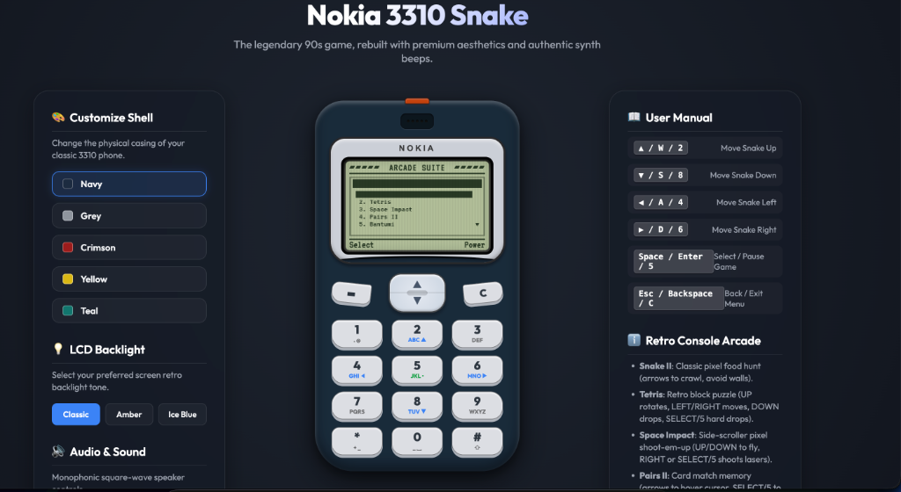

# 📱 Nokia Neon: Modern Nostalgic Arcade Suite 🎮

[](https://nokia-neon.vercel.app/)
[](https://nokia-neon.vercel.app/)
[](https://opensource.org/licenses/MIT)

<p align="center">
  
</p>

Step back into the golden era of mobile gaming! **Nokia Neon** is an exquisitely crafted, fully responsive, offline-first Progressive Web App (PWA) that houses five legendary retro games from the iconic Nokia 3310 era. 

Packaged inside an interactive, high-fidelity glassmorphic virtual Nokia 3310 phone console, Nokia Neon blends authentic retro 90s monophonic charm with state-of-the-art modern web design, silky smooth micro-animations, and high-DPI retina canvas rendering.

> [!NOTE]
> **Experience the Live Console:** Play all the games on the virtual phone using your mouse, keyboard, or touch controls at **[nokia-neon.vercel.app](https://nokia-neon.vercel.app/)**!

---

## 🌟 Key Features

*   **📱 Authentic Interactive Virtual Console**: Features a gorgeously rendered Nokia phone mockup with fully click/touch-interactive buttons, status indicators, and screen glass glare.
*   **📐 Mobile-Responsive Fluid Layout**: Adapts perfectly to any screen size (desktop, tablet, or mobile phone). On mobile devices, the console scales dynamically to maximize the screen space.
*   **⚡ Ultra-Crisp Canvas Drawing (High-DPI)**: Employs a 4x physical-to-logical resolution upscaling strategy (`672x384` physical drawing grid on top of `168x96` logical boundaries) to ensure every pixel and character looks razor-sharp on modern OLED and Retina screens.
*   **🎼 Web Audio Chiptune Synthesizer**: Features a custom oscillator-based synthesizer that programmatically generates nostalgic monophonic beeps, start-up melodies, button presses, and game-specific sound effects without relying on external audio assets.
*   **🔋 Offline-First PWA Capabilities**:
    *   Full Progressive Web App compatibility with offline execution.
    *   Network-first service worker (`sw.js`) caching for blazing fast startups.
    *   Custom cross-platform **"Add to Home Screen"** onboarding:
        *   **Android / Desktop Chrome**: Dynamic install prompts triggered via custom glassmorphic bottom sheets.
        *   **iOS Safari**: Smart sharesheet instructions guiding users step-by-step to Pin the App to their iOS Homescreen.
*   **🛠 Modular & Loose-Coupling Architecture**: Every game resides in its own isolated module file sharing a uniform lifecycle interface (`constructor`, `start`, `step`, `draw`, `handleInput`, `getScore`, `isGameOver`), making it simple to write or inject new retro modules.

---

## 🎮 The Built-In Game Suite

### 1. 🐍 Snake II
The undisputed king of retro mobile games!
*   **Classic Gameplay**: Control the snake, eat food, and grow longer.
*   **Custom Settings**: Choose between borderless traversal (teleport across edges) or strict bordered modes.
*   **Multi-Speed Levels**: 9 selectable speed increments for a customizable difficulty curve.
*   **Chiptune Scoring & Crash Melodies**: Complete with retro audio cues on eating and colliding.

### 2. 🧱 Tetris
A beautiful chiptune puzzle classic.
*   **Perfect Rotation & Drop Math**: Features strict axis constraints, smooth piece rotations, and scoring mechanics.
*   **High-Score Display**: Real-time scores and line counters visible directly on the LCD interface.
*   **Interactive Tapping Controls**: Fully integrated with the console's physical keypad.

### 3. 🚀 Space Impact
A legendary horizontal pixel shooter.
*   **Parallax Background**: Smooth side-scrolling starfield particles.
*   **Action Packed**: Shoot down enemy spaceships, manage shield health, and fire lasers.
*   **Epic Boss Fight**: Survive and eliminate 15 standard ships to summon the huge Boss flagship, complete with its own health bar and distinct audio alert!

### 4. 🃏 Pairs II
Put your cognitive abilities to the test.
*   **Sleek Card Layout**: A 4x3 card-matching grid featuring custom-rendered retro pixel symbols (Spades, Hearts, Clubs, Diamonds, Stars, and Retro Crosses).
*   **Turn Statistics**: Tracks total flipped card attempts and matched sets.
*   **Elegant Card-Flip Animations**: Smooth pixel-art animations showing card fronts and back-patterns.

### 5. 🍒 Bantumi
The legendary Mancala bean-sowing game.
*   **Standard Rules**: 6 small pits, 2 large stores, sowing rules, extra turns, and pit captures.
*   **Smart Local CPU AI**: Challenge an automated opponent that calculates moves in real-time.
*   **Rich Game Status**: Dynamic LCD notifications indicating extra turns, captures, and the final winner.

---

## 🛠 Tech Stack

Nokia Neon is built with focus on extreme performance, absolute modularity, and zero third-party dependencies:
*   **Core Logic**: Vanilla ECMAScript 6+ Modules (Modular JavaScript structure).
*   **Interface**: Semantic HTML5 with Modern CSS3 variables, Glassmorphism gradients, backdrop filters, flexbox, and dynamic media queries.
*   **Graphic Context**: Advanced HTML5 2D Canvas context rendering with High-DPI physical scaling.
*   **Audio Engine**: Standard Web Audio API utilizing Custom Oscillator Nodes and ADSR envelope gain steps.
*   **PWA Core**: Custom Web App Manifest (`manifest.json`) and a native Cache-First Service Worker (`sw.js`).

---

## 🕹 How to Control the Console

You can interact with the games in three separate ways:

| Console Key | Desktop Keyboard Equivalent | Action / function |
| :--- | :--- | :--- |
| **Key 2** | `ArrowUp` / `W` | Move Up / sowing pit navigation |
| **Key 8** | `ArrowDown` / `S` | Move Down / sow beans |
| **Key 4** | `ArrowLeft` / `A` | Move Left / Rotate Tetris piece |
| **Key 6** | `ArrowRight` / `D` | Move Right |
| **Key 5** | `Space` / `Enter` | Primary Shoot (Space Impact) / Confirm / Start |
| **Soft Key (Left)** | `Enter` / Click | Confirm / Main Menu selection |
| **Soft Key (Right)** | `Backspace` / `Escape` / Click | Go Back / Pause |

---

## 🚀 Getting Started Locally

Running the Arcade Suite locally is incredibly lightweight and requires no heavy compiler pipelines.

### Prerequisites
Make sure you have a basic local HTTP development server (like Node.js `http-server` or Python).

### Installation & Run

1. **Clone the repository:**
   ```bash
   git clone https://github.com/biswatma/retrogames.git
   cd retrogames
   ```

2. **Start a local development server:**
   *   **Using Python (Quickest):**
       ```bash
       python3 -m http.server 8080
       ```
   *   **Using Node.js:**
       ```bash
       npm install -g http-server
       http-server -p 8080
       ```

3. **Access in the browser:**
   Open your browser and navigate to `http://localhost:8080`.

---

## 📦 PWA & Deployment

This project is configured to run out-of-the-box on hostings like Vercel, Netlify, Github Pages, or Firebase Hosting.

### Vercel Deployment
To host your own version on Vercel:
1. Link your cloned repository to your Vercel Dashboard.
2. The framework preset is automatically detected as **Other/Static Files**.
3. Click **Deploy**.

---

## 📜 License

Distributed under the MIT License. See `LICENSE` for more information.

---

<p align="center">
Made with ❤️ for retro gaming enthusiasts.
</p>
